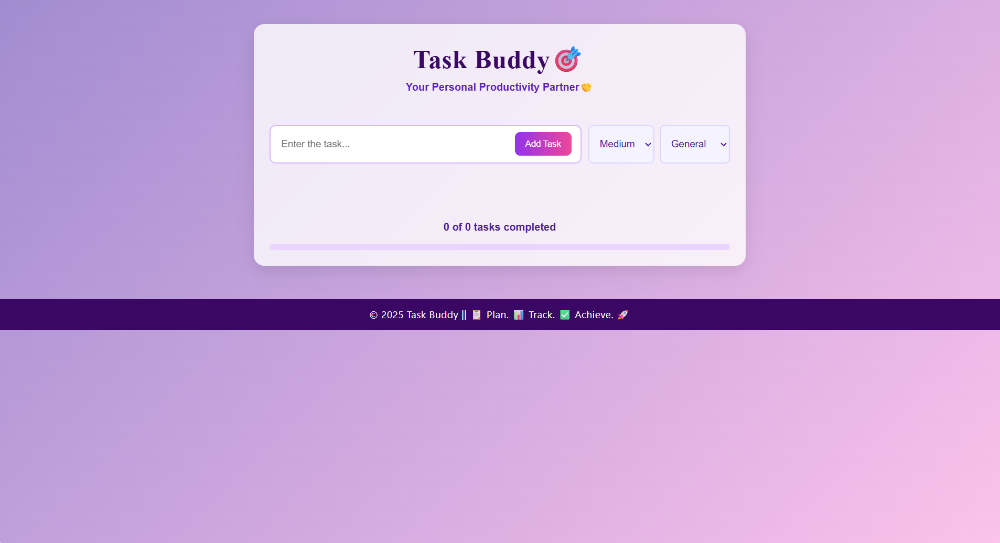
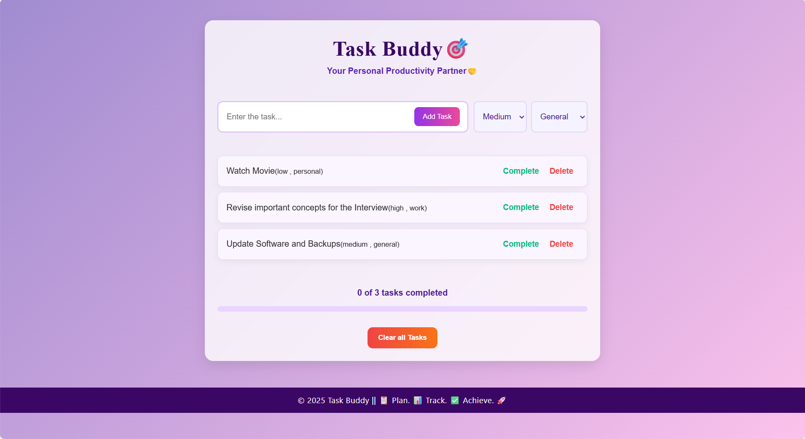
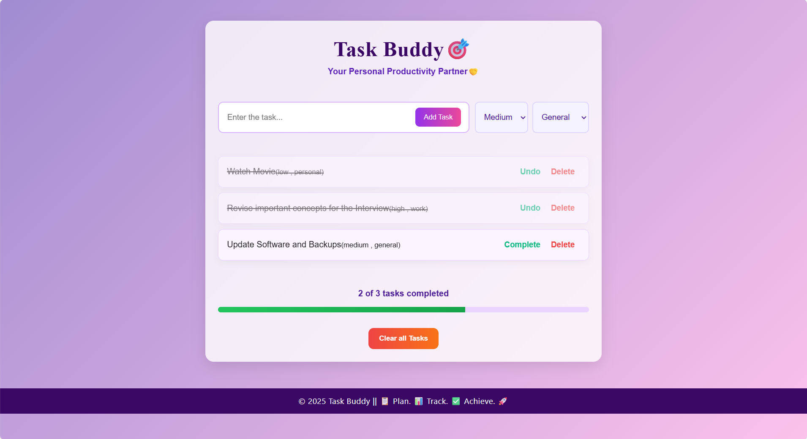

# Task Buddy 🎯  
**Your Personal Productivity Partner**  

Task Buddy is a **React-based Task Management Application** designed to help you stay productive, organized, and on track — whether you're managing personal goals or professional tasks. 💪✨  

---  

### ✅ **Core Functionalities**
- **Add, Delete & Complete Tasks:**  
  Create new tasks, mark them as complete, or remove them instantly.  
- **Persistent Storage (localStorage):**  
  Your tasks remain saved even after refreshing the page.  
- **Responsive Design:**  
  Works smoothly on **desktops, tablets, and mobiles**.  
- **Clear All Tasks:**  
  Remove all tasks at once with a single click.  
- **Dynamic Progress Tracker:**  
  See your productivity in action with a live progress bar.  
- **Smart Validation:**  
  Prevents adding empty or duplicate tasks.  

---

## 🧩 Additional Features  

- 🗂️ **Task Filtering** — Organize tasks based on categories and priority levels.  
- 🕒 **Task History** — View completed tasks and choose to restore or permanently delete them.  
- 💾 **Local Storage Integration** — Ensures your data is persistent and private.  
- 🌈 **Modern UI Design** — Soothing gradient theme with hover effects and dynamic animations.  

---

## 🛠️ Tech Stack  

| Technology | Description |
|-------------|-------------|
| ⚛️ **React.js** | Frontend Framework |
| 💾 **localStorage** | Data Persistence |
| 🧭 **React Hooks (useState, useEffect)** | State Management |
| 🧑‍💻 **JavaScript (ES6+)** | Logic & Functionality |
| 🎨 **CSS3** | Styling & Responsive Design |
| 🌐 **GitHub Pages / Netlify** | Deployment Platform |

---

## 📂 Project Structure  
```
TaskBuddy/
├── public/
├── src/
│ ├── components/
│ │ ├── TaskForm.jsx
│ │ ├── TaskList.jsx
│ │ └── ProgressTracker.jsx
│ ├── App.jsx
│ ├── App.css
│ └── Style.css
├── package.json
└── README.md
```
---

## 🧠 How It Works  

1. **Enter a Task** ✍️  
   Type your task in the input box and choose its **priority** and **category**.  
2. **Manage Tasks Easily** 🗑️  
   Mark them as *Complete*, *Undo*, or *Delete* when needed.  
3. **Track Progress** 📊  
   The progress bar updates automatically based on your completed tasks.  
4. **Persistent Storage** 💾  
   Tasks are saved in your browser's local storage even after refreshing.  
5. **Clear All** 🧹  
   Reset your list anytime to start fresh!  

---

## 🖼️ Screenshots  

### 🏠 Home Interface  


### 🧾 Task Management View  


### 📈 Progress Tracking  


---

## ⚙️ Requirements  

| Requirement | Description |
|--------------|-------------|
| 💻 **Frontend Framework** | React.js |
| 🧩 **Data Storage** | localStorage |
| 🧭 **Version Control** | Git + GitHub |
| 🚀 **Deployment** | GitHub Pages or Netlify |
| 🧰 **Tools** | VS Code, Chrome, Node.js, npm |

---

## 🚀 Installation & Setup  
```
Follow these steps to run the project locally 👇  

1. Clone the repository
   ```bash
   git clone https://github.com/your-username/TaskBuddy.git
   ```

2. Navigate into the project folder
   ```bash
   cd TaskBuddy
   ```
3. Install dependencies
   ```bash
   npm install
   ```
4. Start the development server
   ```bash
   npm start
   ```
---

##  License

This project is licensed under the **MIT License**.  
See the [LICENSE](LICENSE) file for details.
